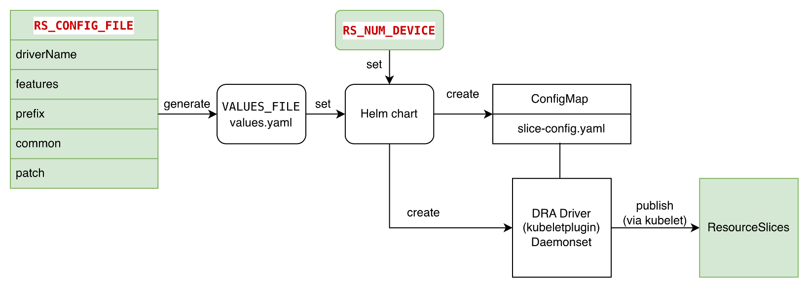

# Demo for ConsumableCapacity Feature

For demonstration purposes, this feature branch extends kubernetes-sigs/dra-example-driver
with functionality to generate and manage ResourceSlices based on the specified device count and slice configuration.
This enhancement enables developers to experiment with and test DRA features across different scenarios defined in the configuration manifest — without needing to modify the code or rebuild the driver image.



## Required Tools

- kind
- podman
- go >= v1.25
- yq

## Prepare environment

## Build driver image

```sh
CONTAINER_TOOL=podman ./demo/build-driver.sh
```

### Create Kind Cluster

```sh
KIND_CLUSTER_CONFIG_PATH=./demo/consumablecapacity/kind-cluster-config.yaml  \
BUILD_KIND_IMAGE=false CONTAINER_TOOL=podman KIND_IMAGE=ghcr.io/sunya-ch/kindest/node:v1.35.0-dev \
./demo/create-cluster.sh
```

The [prepared kind configuration](kind-cluster-config.yaml) enables the following features.

```yaml
featureGates:
  DynamicResourceAllocation: true
  DRAPrioritizedList: true
  DRAPartitionableDevices: true
  DRAResourceClaimDeviceStatus: true
  DRAConsumableCapacity: true
```

> [!NOTE]
> Please ensure to run this snippet code in the root directory

#### Reload the image if needed

If the driver needs rebuilt, the reload to the kind cluster is required.

```sh
CONTAINER_TOOL=podman ./demo/build-driver.sh
./demo/scripts/load-driver-image-into-kind.sh
```

## Demos

- [Fake Network Card DRA Driver](./requests/nic/)
- [Fake GPU Card DRA Driver](./requests/vgpu)
