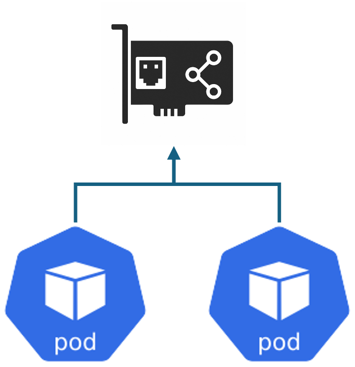
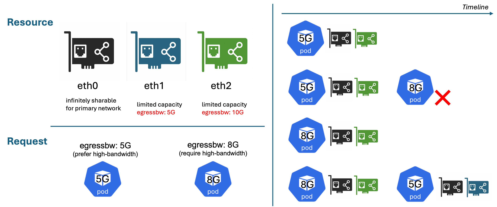
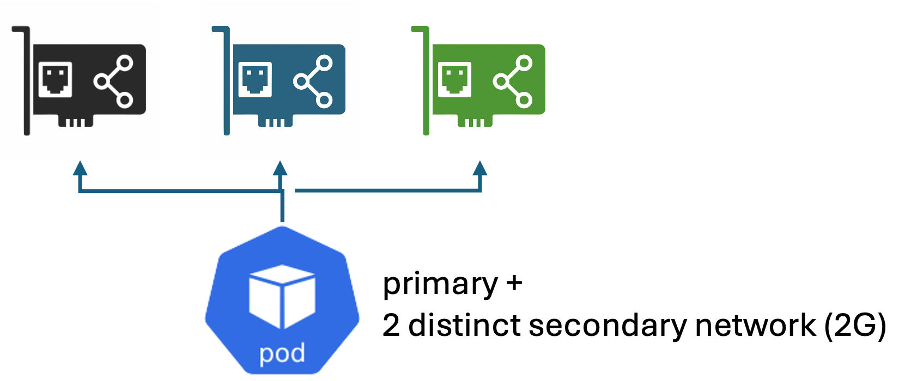

# Fake Network Card DRA Driver Demos

This document explains steps to demonstrate DRAConsumableCapacity feature on fake Network cards examples with the following driver config.

```yaml
driverName: nic.networking.io
features:
  DRAConsumableCapacity: true
prefix: eth
common:
  allowMultipleAllocations: true
  capacity:
    egressbw:
      value: "10G"
      requestPolicy:
        default: "1G"
        validRange:
          min: "1G"
patch:
  devices:
    eth0:
      capacity:
        egressbw:
          value: "1G"
          requestPolicy: # infinite share
            default: "0"
            validValues: ["0"]
    eth1:
      capacity:
        egressbw:
          value: "5G" # no policy

```

[nicslice.yaml](../../config/nicslice.yaml)

## Install Example Network Card DRA Driver

```sh
RS_CONFIG=nicslice RS_NUM_DEVICE=3 ./demo/consumablecapacity/scripts/install-driver.sh
```

Expected Resourceslice:

```yaml
  devices:
    - allowMultipleAllocations: true
      attributes:
        index:
          int: 0
        name:
          string: eth0
        uuid:
          string: eth18db0e85-99e9-c746-8531-ffeb86328b39
      capacity:
        egressbw:
          requestPolicy:
            default: "0"
            validValues:
              - "0"
          value: 1G
      name: eth0
    - allowMultipleAllocations: true
      attributes:
        index:
          int: 1
        name:
          string: eth1
        uuid:
          string: eth93d37703-997c-c46f-a531-755e3e0dc2ac
      capacity:
        egressbw:
          value: 5G
      name: eth1
    - allowMultipleAllocations: true
      attributes:
        index:
          int: 2
        name:
          string: eth2
        uuid:
          string: ethee3e4b55-fcda-44b8-0605-64b7a9967744
      capacity:
        egressbw:
          requestPolicy:
            default: 1G
            validRange:
              min: 1G
          value: 10G
      name: eth2
  driver: nic.networking.io
```

## Examples

For example, the common resources including DeviceClass and ResourceClaimTemplates are packed in the common folder. Please install:

```sh
kubectl apply -f ./demo/consumablecapacity/requests/nic/common
```

### Example 1

Example one demonstrates two simple Pods with primary network (eth0) can be running.



```sh
kubectl apply -f ./demo/consumablecapacity/requests/nic/example-1.yaml
```

### Example 2

Testing on two Pods requesting for one primary network and one secondary network with guaranteed 5G and 8G egress bandwidth respectively. The first Pod prefers high-bandwidth network card but also accept any secondary card as an option. Meanwhile, the second Pod requests only high-bandwidth network card for the secondary network.



- step 1: deploy preferred Pod (5G) first

    ```sh
    kubectl apply -f ./demo/consumablecapacity/requests/nic/example-2/prefer.yaml
    ```

    The Pod should be running with its first preference (eth0, eth2).

    ```yaml
    > kubectl get resourceclaim -oyaml|yq .items[0].status

    allocation:
    devices:
        results:
        - consumedCapacity:
            egressbw: "0"
            device: eth0
            driver: nic.networking.io
            pool: dra-example-driver-cluster-worker
            request: req0
            shareID: a7020180-94f3-4967-99d4-6fa7ac0e911b
        - consumedCapacity:
            egressbw: 5G
            device: eth2
            driver: nic.networking.io
            pool: dra-example-driver-cluster-worker
            request: req1/highbw
            shareID: af658780-b774-40ac-af9c-e9696e596567
    nodeSelector:
        nodeSelectorTerms:
        - matchFields:
            - key: metadata.name
                operator: In
                values:
                - dra-example-driver-cluster-worker
    reservedFor:
    - name: highbw-preferred-pod
        resource: pods
        uid: c1019a9c-496f-470c-8f17-828fb34bdf47
    ```

- step 2: deploy required Pod (8G)

    ```sh
    kubectl apply -f ./demo/consumablecapacity/requests/nic/example-2/require.yaml
    ```

    The Pod should be in Pending state.

    ```sh
    > kubectl get po highbw-required-pod -oyaml|yq .status.conditions[0]

    lastProbeTime: null
    lastTransitionTime: "2025-10-31T03:01:35Z"
    message: '0/2 nodes are available: 1 cannot allocate all claims, 1 node(s) had untolerated taint {node-role.kubernetes.io/control-plane: }. still not schedulable, preemption: 0/2 nodes are available: 2 Preemption is not helpful for scheduling.'
    observedGeneration: 1
    reason: Unschedulable
    status: "False"
    type: PodScheduled
    ```

- step 3: delete blocking Pod (5G)

    ```sh
    kubectl delete -f ./demo/consumablecapacity/requests/nic/example-2/prefer.yaml
    ```

    The required Pod should become Running with (eth0, eth2).

    ```yaml
    NAME                  READY   STATUS    RESTARTS   AGE
    highbw-required-pod   1/1     Running   0          48s

    > kubectl get resourceclaim -oyaml|yq .items[0].status
    allocation:
    devices:
        results:
        - consumedCapacity:
            egressbw: "0"
            device: eth0
            driver: nic.networking.io
            pool: dra-example-driver-cluster-worker
            request: req0
            shareID: c964d342-f10a-4e24-a6f1-cc82e3de7dff
        - consumedCapacity:
            egressbw: 8G
            device: eth2
            driver: nic.networking.io
            pool: dra-example-driver-cluster-worker
            request: req1
            shareID: 3305ddd1-d8e9-4a2e-833c-40c172e91673
    nodeSelector:
        nodeSelectorTerms:
        - matchFields:
            - key: metadata.name
                operator: In
                values:
                - dra-example-driver-cluster-worker
    reservedFor:
    - name: highbw-required-pod
        resource: pods
        uid: 0d31f707-d89d-4848-9e80-370101caaa4d

    ```

- step 4: retry deploy preferred Pod (5G)

    ```sh
    kubectl apply -f ./demo/consumablecapacity/requests/nic/example-2/prefer.yaml
    ```

    Now, both Pods should be Running. But the preferred Pod will get the second option (eth0, eth1).

    ```yaml
    pod/highbw-preferred-pod condition met
    NAME                   READY   STATUS    RESTARTS   AGE
    highbw-preferred-pod   1/1     Running   0          12s
    highbw-required-pod    1/1     Running   0          86s

    > kubectl get resourceclaim -oyaml|yq .items[0].status

    allocation:
    devices:
        results:
        - consumedCapacity:
            egressbw: "0"
            device: eth0
            driver: nic.networking.io
            pool: dra-example-driver-cluster-worker
            request: req0
            shareID: d35d3447-16f9-4264-8360-4d67e2f376d0
        - consumedCapacity:
            egressbw: 5G
            device: eth1
            driver: nic.networking.io
            pool: dra-example-driver-cluster-worker
            request: req1/any
            shareID: cbf3b7a7-0c64-4e75-a1d8-cca85556b07a
    nodeSelector:
        nodeSelectorTerms:
        - matchFields:
            - key: metadata.name
                operator: In
                values:
                - dra-example-driver-cluster-worker
    reservedFor:
    - name: highbw-preferred-pod
        resource: pods
        uid: 1ca182cc-c36b-449d-b281-34e45af744fb
    ```

### Example 3

Example three demonstrates a Pod can request distinct cards to get a different cards even if there are enough capacity for two requests within a single card.



```sh
kubectl apply -f ./demo/consumablecapacity/requests/nic/example-3.yaml