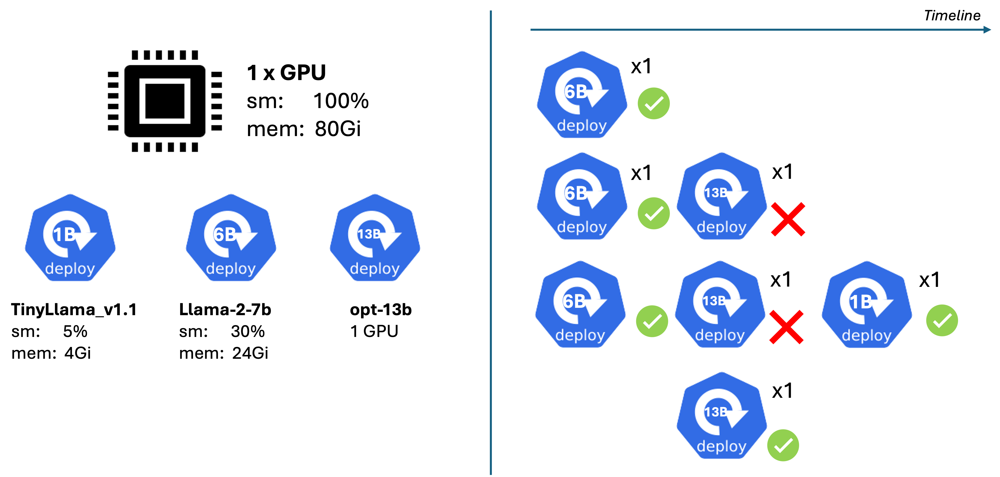
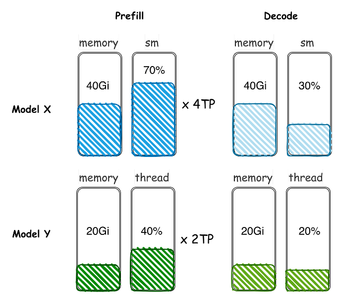
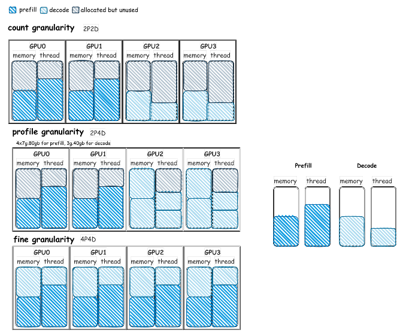

# Fake GPU Card DRA Driver Demos

> [!NOTE]
> Please ensure to run the following step from the root path.

This document explains steps to demonstrate DRAConsumableCapacity feature on fake GPU examples with the following driver config.

```yaml
driverName: vgpu.example.com
features:
  DRAConsumableCapacity: true
prefix: gpu-
common:
  allowMultipleAllocations: true
  capacity:
    count:
      value: "1"
      requestPolicy:
        default: "0"
    sm:
      value: "100"
      requestPolicy:
        default: "100"
        min: "1"
    memory:
      value: "80Gi"
      requestPolicy:
        default: "80Gi"
        min: "512Mi"
        step: "512Mi"

```

[vgpuslice.yaml](../../config/vgpuslice.yaml)

## Install Example Network Card DRA Driver

There are two test scenarios: [decode-only](#decode-only-example) and [prefill/decode disggregation](#prefilldecode-disaggregation-examples).

For Decode-only Example, use `RS_NUM_DEVICE=1`

```sh
RS_CONFIG=vgpuslice RS_NUM_DEVICE=1 ./demo/consumablecapacity/scripts/install-driver.sh
```

For Prefill/Decode Disaggregation Examples, use `RS_NUM_DEVICE=8`

```sh
RS_CONFIG=vgpuslice RS_NUM_DEVICE=8 ./demo/consumablecapacity/scripts/install-driver.sh
```

## Examples

These example manifests are modified from llm-d's [vLLM Simulator](https://github.com/llm-d/llm-d-inference-sim).

### Prepare the llm-d-inference-sim image

To build the image, please refer to [this guide](https://github.com/llm-d/llm-d-inference-sim?tab=readme-ov-file#building).

```sh
podman pull ghcr.io/llm-d/llm-d-inference-sim:dev
DRIVER_IMAGE=ghcr.io/llm-d/llm-d-inference-sim:dev ./demo/scripts/load-driver-image-into-kind.sh
```

### Decode-only Example

Testing consumable capacity on 1 GPU where there are three decode-only deployments with the requirements as presented in the picture.



- step 1: deploy common resources i.e., DeviceClass and ResourceClaimTemplate

    ```sh
    kubectl apply -f ./demo/consumablecapacity/requests/vgpu/common
    ```

- step 2: deploy all three model serving deployments (started with replicas: 0)

    ```sh
    kubectl apply -f ./demo/consumablecapacity/requests/vgpu/example-1
    ```

- step 3: scale `vllm-llama2-7b` request to 1 replica

    ```sh
    kubectl scale deployment vllm-llama2-7b --replicas=1
    ```

    Expecting `Running` state

- step 4: scale `vllm-opt-13b` request to 1 replica

    ```sh
    kubectl scale deployment vllm-opt-13b --replicas=1
    ```

    Expecting `Pending` state

- step 5: scale `vllm-tinyllama-1b` to 1 replica

    ```sh
    kubectl scale deployment vllm-tinyllama-1b --replicas=1
    ```

    Expecting `Running` state while `vllm-opt-13b` still in `Pending`

- step 6: scale down `vllm-llama2-7b` and `vllm-tinyllama-1b` to 0

    ```sh
    > kubectl scale deploy vllm-llama2-7b --replicas=0; kubectl scale deploy vllm-tinyllama-1b --replicas=0
    ```

    Expecting `vllm-opt-13b` to be `Running`

### Prefill/Decode Disaggregation Examples

Example 2 to 4 demonstrates how the DRAConsumableCapacity can fit in different resource requirements in the Prefill/Decode disaggragation use case.

Given the following requirement per replica for Model X (llama3-8b), and Model Y (granite-2b):



Given 8 GPUs, we can theoritically fit

#### Deployment-1

- Llma-8b 2x(4TPx40Gi/70threads) Prefill
- Llam-8b 8x(40Gi/30threads) Decode

#### Deployment-2

- Granite-2b 4x(2x20Gi/40threads) Prefill
- Granite-2b 24x(20Gi/20threads) Decode

#### Deployment-3

- Llma-8b 1x(4x40Gi/70threads) Prefill
- Llma-8b 4x(40Gi/30threads) Decode
- Granite-2b 2x(2x20Gi/40threads) Prefill
- Granite-2b 12x(20Gi/20threads) Decode

### Comparing to MIG Instance

Available MIG profile for A100-SXM4-80GB are 1g.10gb, 2g.20gb, 3g.40gb, 4g.40gb, and 7g.80gb.

- Llma-8b Prefill needs 4TP x 7g.80gb (compute bound)
- Llma-8b Decode needs at least 3g.40gb (memory bound)
- Granite-2b Prefill needs 2TP x 4g.40gb (compute bound)
- Granite-2b Decode needs at least 2g.20gb (memory bound)

For each scenarios,

- Deployment-1: 1x(4x7g.80gb) + 8x(3g.40gb)
- Deployment-2: 4x(2x4g.40gb) + 8x(3g.40gb) --> 2x2g.20gb cannot fit in, so 3g.40gb must be used
- Deployment-3: Llam [1x(4x7g.80gb) + 2x(3g.40gb)] + Granite [2x(2x4g.40gb) +  + 2x(3g.40gb)]

The below illustration shows fitting comparision among count granularity, profile granularity, and fine granularity of Model X to 4 GPUs.

